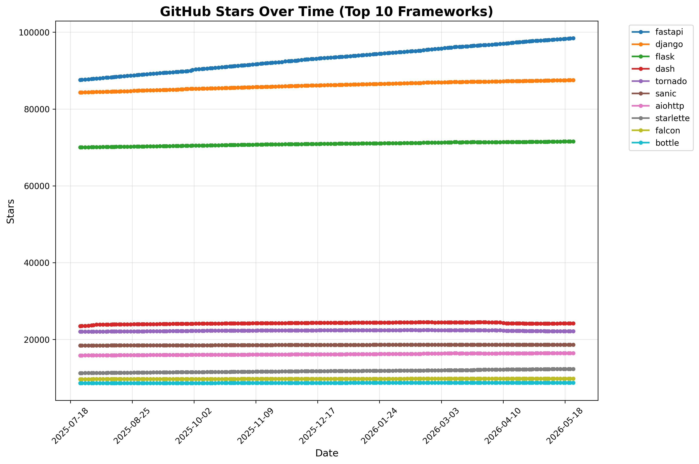
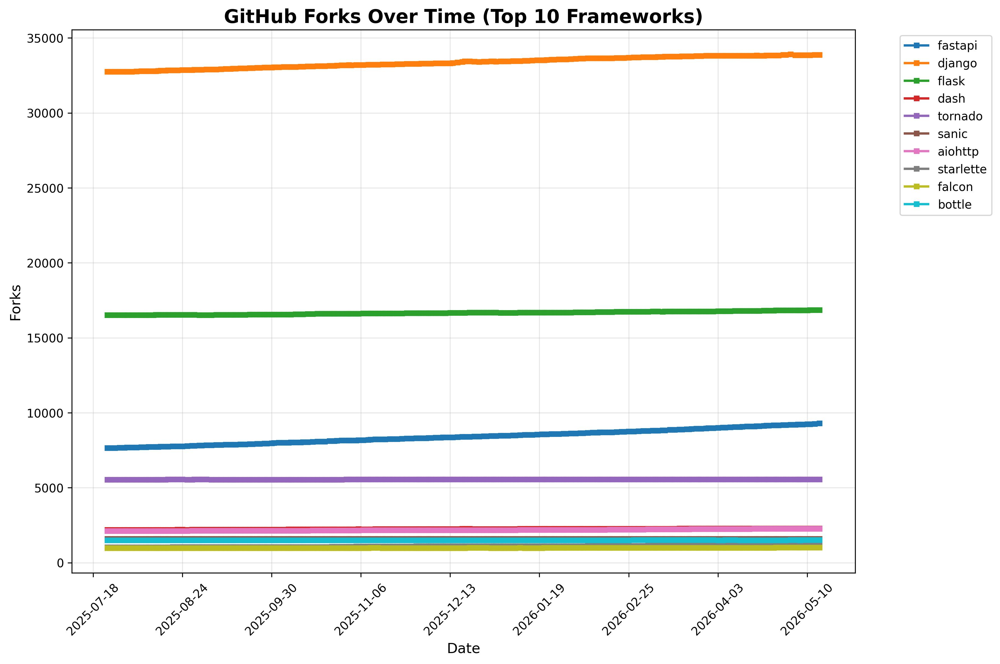

# Top Python Web Frameworks
A list of popular github projects related to Python web framework (ranked by stars automatically)

* UPDATE **list.txt** (via Pull Request)

## 📈 Current Rankings

| Project Name | Stars | Forks | Open Issues | Last Commit |
| ------------ | ----- | ----- | ----------- | ----------- |
| [fastapi](https://github.com/fastapi/fastapi) | 96945 | 9026 | 166 | 2026-04-07 09:50:22 |
| [django](https://github.com/django/django) | 87196 | 33809 | 427 | 2026-04-07 19:38:35 |
| [flask](https://github.com/pallets/flask) | 71383 | 16774 | 3 | 2026-04-05 19:32:14 |
| [dash](https://github.com/plotly/dash) | 24442 | 2272 | 548 | 2026-04-07 14:37:03 |
| [tornado](https://github.com/tornadoweb/tornado) | 22390 | 5544 | 215 | 2026-03-31 00:51:33 |
| [sanic](https://github.com/sanic-org/sanic) | 18640 | 1587 | 128 | 2025-12-31 19:05:34 |
| [aiohttp](https://github.com/aio-libs/aiohttp) | 16378 | 2242 | 274 | 2026-04-07 01:11:52 |
| [starlette](https://github.com/Kludex/starlette) | 12181 | 1153 | 53 | 2026-04-05 11:52:25 |
| [falcon](https://github.com/falconry/falcon) | 9805 | 987 | 163 | 2026-04-07 15:03:19 |
| [bottle](https://github.com/bottlepy/bottle) | 8771 | 1499 | 283 | 2026-03-23 15:39:31 |
| [hug](https://github.com/hugapi/hug) | 6896 | 389 | 187 | 2023-06-30 13:14:01 |
| [eve](https://github.com/pyeve/eve) | 6740 | 735 | 26 | 2026-03-24 08:02:34 |
| [vibora](https://github.com/vibora-io/vibora) | 5602 | 301 | 140 | 2019-02-11 10:54:12 |
| [pyramid](https://github.com/Pylons/pyramid) | 4082 | 894 | 86 | 2026-03-11 01:27:19 |
| [quart](https://github.com/pallets/quart) | 3618 | 194 | 66 | 2025-09-01 18:49:41 |
| [masonite](https://github.com/MasoniteFramework/masonite) | 2363 | 137 | 24 | 2025-03-20 20:11:49 |
| [web2py](https://github.com/web2py/web2py) | 2172 | 905 | 365 | 2026-04-07 11:19:41 |
| [cherrypy](https://github.com/cherrypy/cherrypy) | 1941 | 367 | 267 | 2025-11-20 00:36:37 |
| [tg2](https://github.com/TurboGears/tg2) | 813 | 81 | 14 | 2025-11-13 15:58:08 |
| [Growler](https://github.com/pyGrowler/Growler) | 689 | 20 | 5 | 2020-03-08 07:51:41 |
| [morepath](https://github.com/morepath/morepath) | 396 | 39 | 76 | 2025-11-18 10:36:49 |
| [circuits](https://github.com/circuits/circuits) | 316 | 56 | 42 | 2024-04-03 22:38:28 |

## 📊 Growth Trends

### Stars Growth Over Time

### Forks Growth Over Time

*Charts show the top 10 frameworks by current star count*

*Last Automatic Update: 2026-04-08T02:31:04*