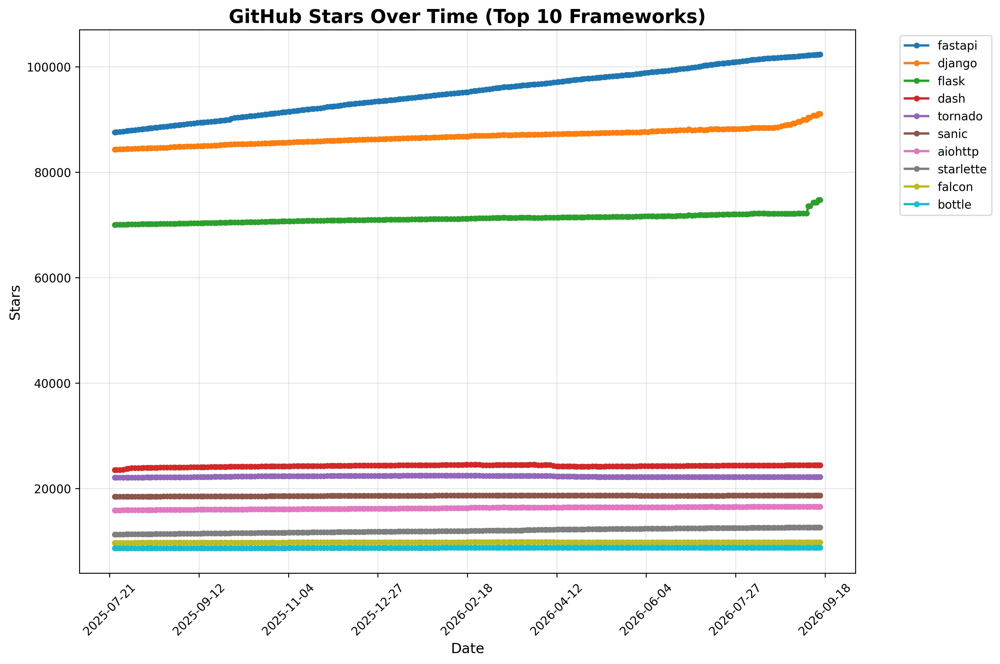
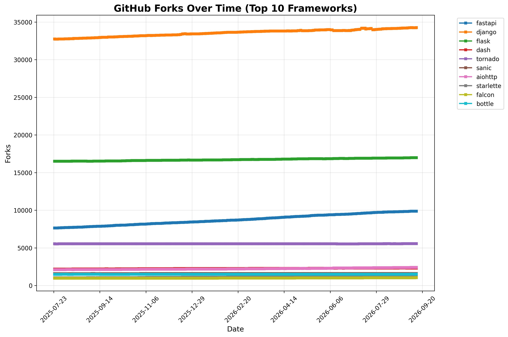

# Top Python Web Frameworks
A list of popular github projects related to Python web framework (ranked by stars automatically)

* UPDATE **list.txt** (via Pull Request)

## 📈 Current Rankings

| Project Name | Stars | Forks | Open Issues | Last Commit |
| ------------ | ----- | ----- | ----------- | ----------- |
| [fastapi](https://github.com/fastapi/fastapi) | 101140 | 9718 | 79 | 2026-07-29 17:15:38 |
| [django](https://github.com/django/django) | 88254 | 34061 | 449 | 2026-07-31 20:47:42 |
| [flask](https://github.com/pallets/flask) | 72017 | 16924 | 7 | 2026-07-30 17:29:33 |
| [dash](https://github.com/plotly/dash) | 24362 | 2311 | 541 | 2026-07-29 18:08:52 |
| [tornado](https://github.com/tornadoweb/tornado) | 22192 | 5549 | 249 | 2026-07-08 17:05:41 |
| [sanic](https://github.com/sanic-org/sanic) | 18640 | 1594 | 143 | 2026-05-31 19:29:09 |
| [aiohttp](https://github.com/aio-libs/aiohttp) | 16506 | 2361 | 220 | 2026-07-31 14:54:23 |
| [starlette](https://github.com/Kludex/starlette) | 12510 | 1254 | 77 | 2026-07-04 05:14:17 |
| [falcon](https://github.com/falconry/falcon) | 9791 | 1020 | 157 | 2026-07-31 07:09:03 |
| [bottle](https://github.com/bottlepy/bottle) | 8772 | 1500 | 287 | 2026-07-19 07:21:44 |
| [hug](https://github.com/hugapi/hug) | 6885 | 390 | 188 | 2023-06-30 13:14:01 |
| [eve](https://github.com/pyeve/eve) | 6748 | 738 | 28 | 2026-03-24 08:02:34 |
| [vibora](https://github.com/vibora-io/vibora) | 5587 | 299 | 140 | 2019-02-11 10:54:12 |
| [pyramid](https://github.com/Pylons/pyramid) | 4092 | 891 | 89 | 2026-03-11 01:27:19 |
| [quart](https://github.com/pallets/quart) | 3653 | 203 | 42 | 2026-07-23 20:24:33 |
| [masonite](https://github.com/MasoniteFramework/masonite) | 2360 | 137 | 1 | 2026-06-07 17:52:11 |
| [web2py](https://github.com/web2py/web2py) | 2168 | 916 | 357 | 2026-07-29 16:59:19 |
| [cherrypy](https://github.com/cherrypy/cherrypy) | 1945 | 367 | 267 | 2025-11-20 00:36:37 |
| [tg2](https://github.com/TurboGears/tg2) | 813 | 84 | 14 | 2026-07-14 21:14:03 |
| [Growler](https://github.com/pyGrowler/Growler) | 688 | 21 | 5 | 2020-03-08 07:51:41 |
| [morepath](https://github.com/morepath/morepath) | 395 | 40 | 78 | 2026-06-12 07:57:45 |
| [circuits](https://github.com/circuits/circuits) | 317 | 57 | 41 | 2026-04-26 08:04:09 |

## 📊 Growth Trends

### Stars Growth Over Time

### Forks Growth Over Time

*Charts show the top 10 frameworks by current star count*

*Last Automatic Update: 2026-08-02T02:47:33*