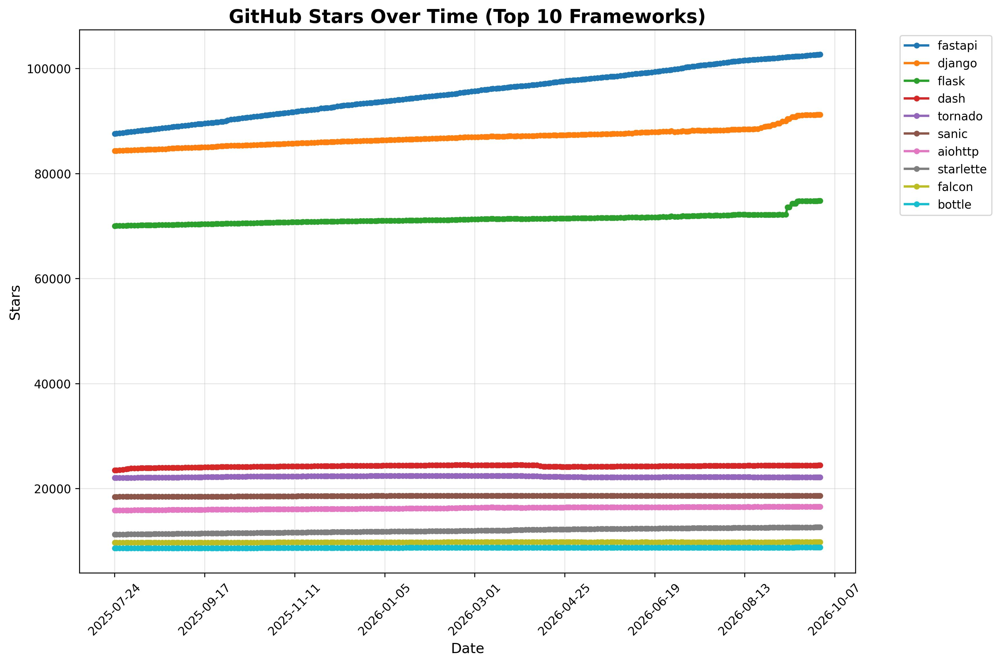
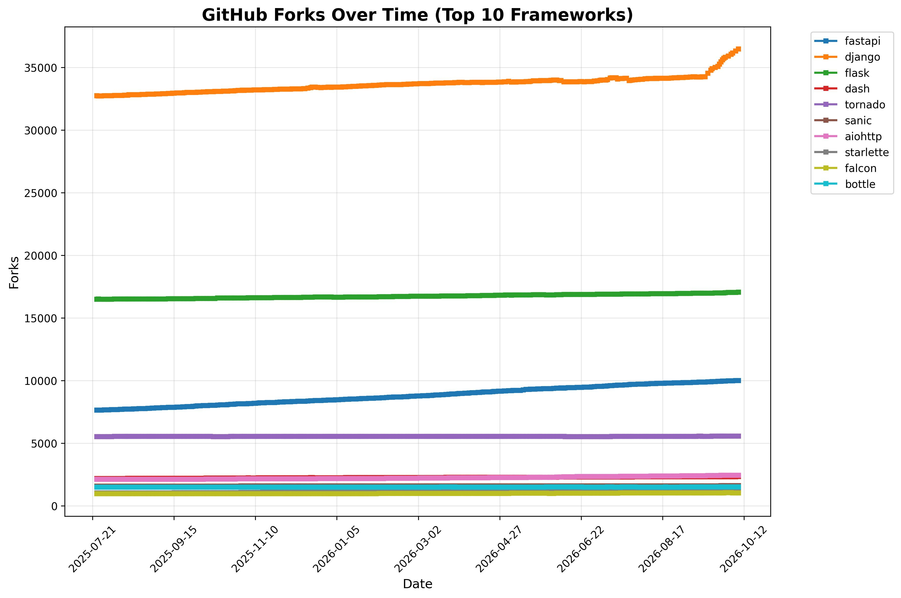

# Top Python Web Frameworks
A list of popular github projects related to Python web framework (ranked by stars automatically)

* UPDATE **list.txt** (via Pull Request)

## 📈 Current Rankings

| Project Name | Stars | Forks | Open Issues | Last Commit |
| ------------ | ----- | ----- | ----------- | ----------- |
| [fastapi](https://github.com/fastapi/fastapi) | 102831 | 9994 | 86 | 2026-10-05 13:38:35 |
| [django](https://github.com/django/django) | 91329 | 36327 | 529 | 2026-10-05 23:01:57 |
| [flask](https://github.com/pallets/flask) | 74905 | 17042 | 4 | 2026-09-08 16:40:41 |
| [dash](https://github.com/plotly/dash) | 24441 | 2328 | 437 | 2026-10-05 18:29:00 |
| [tornado](https://github.com/tornadoweb/tornado) | 22168 | 5564 | 214 | 2026-10-06 01:10:40 |
| [sanic](https://github.com/sanic-org/sanic) | 18636 | 1608 | 157 | 2026-05-31 19:29:09 |
| [aiohttp](https://github.com/aio-libs/aiohttp) | 16569 | 2439 | 221 | 2026-10-05 23:36:48 |
| [starlette](https://github.com/Kludex/starlette) | 12655 | 1361 | 58 | 2026-10-05 16:52:31 |
| [falcon](https://github.com/falconry/falcon) | 9806 | 1037 | 158 | 2026-09-30 18:01:26 |
| [bottle](https://github.com/bottlepy/bottle) | 8793 | 1513 | 289 | 2026-09-18 09:06:45 |
| [hug](https://github.com/hugapi/hug) | 6879 | 391 | 189 | 2023-06-30 13:14:01 |
| [eve](https://github.com/pyeve/eve) | 6749 | 737 | 28 | 2026-03-24 08:02:34 |
| [vibora](https://github.com/vibora-io/vibora) | 5580 | 300 | 140 | 2019-02-11 10:54:12 |
| [pyramid](https://github.com/Pylons/pyramid) | 4099 | 893 | 90 | 2026-08-04 21:13:49 |
| [quart](https://github.com/pallets/quart) | 3671 | 209 | 28 | 2026-09-12 09:07:19 |
| [masonite](https://github.com/MasoniteFramework/masonite) | 2360 | 135 | 1 | 2026-06-07 17:52:11 |
| [web2py](https://github.com/web2py/web2py) | 2170 | 917 | 357 | 2026-09-29 17:17:23 |
| [cherrypy](https://github.com/cherrypy/cherrypy) | 1949 | 370 | 277 | 2025-11-20 00:36:37 |
| [tg2](https://github.com/TurboGears/tg2) | 811 | 84 | 14 | 2026-08-12 22:15:50 |
| [Growler](https://github.com/pyGrowler/Growler) | 688 | 22 | 5 | 2020-03-08 07:51:41 |
| [morepath](https://github.com/morepath/morepath) | 395 | 40 | 77 | 2026-10-05 17:39:06 |
| [circuits](https://github.com/circuits/circuits) | 316 | 56 | 41 | 2026-10-05 23:20:26 |

## 📊 Growth Trends

### Stars Growth Over Time

### Forks Growth Over Time

*Charts show the top 10 frameworks by current star count*

*Last Automatic Update: 2026-10-06T05:12:15*