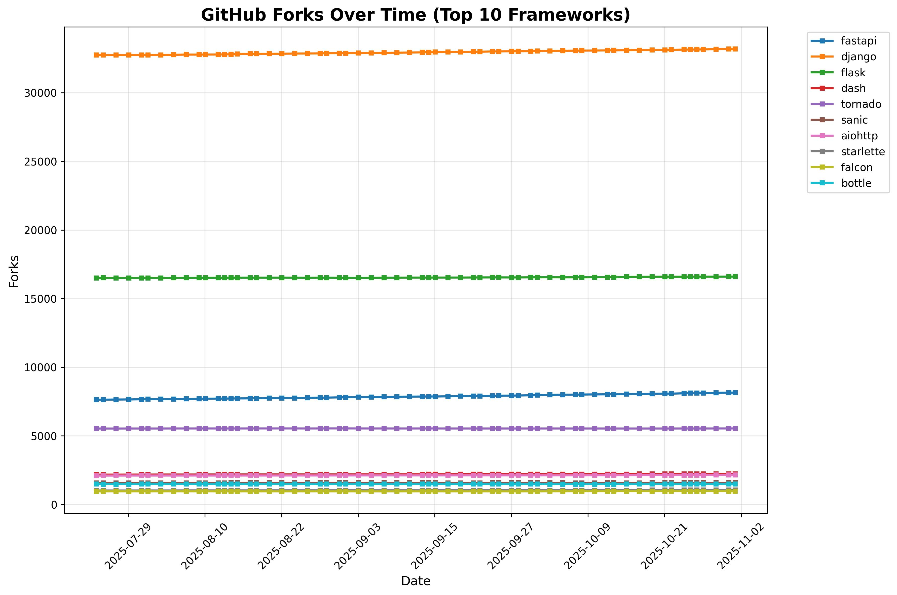

# Top Python Web Frameworks
A list of popular github projects related to Python web framework (ranked by stars automatically)

* UPDATE **list.txt** (via Pull Request)

## 📈 Current Rankings

| Project Name | Stars | Forks | Open Issues | Last Commit |
| ------------ | ----- | ----- | ----------- | ----------- |
| [fastapi](https://github.com/fastapi/fastapi) | 93457 | 8428 | 198 | 2025-12-26 20:40:51 |
| [django](https://github.com/django/django) | 86259 | 33414 | 374 | 2025-12-26 15:29:06 |
| [flask](https://github.com/pallets/flask) | 70971 | 16667 | 13 | 2025-11-17 18:05:51 |
| [dash](https://github.com/plotly/dash) | 24364 | 2246 | 553 | 2025-12-18 16:21:06 |
| [tornado](https://github.com/tornadoweb/tornado) | 22402 | 5544 | 210 | 2025-12-17 18:38:43 |
| [sanic](https://github.com/sanic-org/sanic) | 18608 | 1586 | 131 | 2025-12-04 05:51:30 |
| [aiohttp](https://github.com/aio-libs/aiohttp) | 16159 | 2171 | 269 | 2025-12-25 10:15:27 |
| [starlette](https://github.com/Kludex/starlette) | 11788 | 1093 | 52 | 2025-12-24 11:58:57 |
| [falcon](https://github.com/falconry/falcon) | 9773 | 975 | 163 | 2025-12-07 23:04:31 |
| [bottle](https://github.com/bottlepy/bottle) | 8718 | 1489 | 285 | 2025-09-19 11:25:45 |
| [hug](https://github.com/hugapi/hug) | 6907 | 390 | 186 | 2023-06-30 13:14:01 |
| [eve](https://github.com/pyeve/eve) | 6744 | 740 | 36 | 2025-12-02 14:44:05 |
| [vibora](https://github.com/vibora-io/vibora) | 5621 | 302 | 140 | 2019-02-11 10:54:12 |
| [pyramid](https://github.com/Pylons/pyramid) | 4069 | 888 | 91 | 2024-12-20 23:21:35 |
| [quart](https://github.com/pallets/quart) | 3565 | 192 | 66 | 2025-09-01 18:49:41 |
| [masonite](https://github.com/MasoniteFramework/masonite) | 2335 | 136 | 21 | 2025-03-20 20:11:49 |
| [web2py](https://github.com/web2py/web2py) | 2169 | 911 | 369 | 2025-12-20 07:27:33 |
| [cherrypy](https://github.com/cherrypy/cherrypy) | 1929 | 369 | 265 | 2025-11-20 00:36:37 |
| [tg2](https://github.com/TurboGears/tg2) | 814 | 83 | 14 | 2025-11-13 15:58:08 |
| [Growler](https://github.com/pyGrowler/Growler) | 689 | 21 | 5 | 2020-03-08 07:51:41 |
| [morepath](https://github.com/morepath/morepath) | 396 | 39 | 76 | 2025-11-18 10:36:49 |
| [circuits](https://github.com/circuits/circuits) | 317 | 56 | 42 | 2024-04-03 22:38:28 |

## 📊 Growth Trends

### Stars Growth Over Time

### Forks Growth Over Time

*Charts show the top 10 frameworks by current star count*

*Last Automatic Update: 2025-12-27T01:42:54*