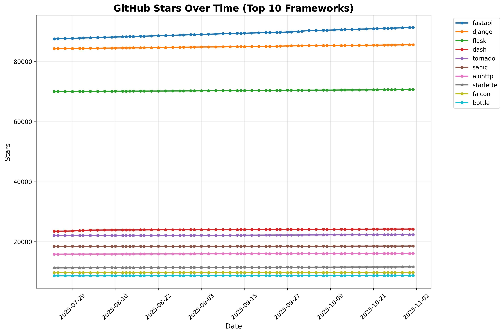

# Top Python Web Frameworks
A list of popular github projects related to Python web framework (ranked by stars automatically)

* UPDATE **list.txt** (via Pull Request)

## 📈 Current Rankings

| Project Name | Stars | Forks | Open Issues | Last Commit |
| ------------ | ----- | ----- | ----------- | ----------- |
| [fastapi](https://github.com/fastapi/fastapi) | 92106 | 8248 | 220 | 2025-11-20 10:45:39 |
| [django](https://github.com/django/django) | 85852 | 33241 | 360 | 2025-11-20 22:31:31 |
| [flask](https://github.com/pallets/flask) | 70802 | 16626 | 12 | 2025-11-17 18:05:51 |
| [dash](https://github.com/plotly/dash) | 24266 | 2234 | 584 | 2025-11-18 17:05:04 |
| [tornado](https://github.com/tornadoweb/tornado) | 22352 | 5543 | 206 | 2025-09-17 17:43:47 |
| [sanic](https://github.com/sanic-org/sanic) | 18570 | 1584 | 150 | 2025-03-31 21:19:26 |
| [aiohttp](https://github.com/aio-libs/aiohttp) | 16099 | 2157 | 286 | 2025-10-29 10:19:08 |
| [starlette](https://github.com/Kludex/starlette) | 11675 | 1080 | 52 | 2025-11-04 07:29:23 |
| [falcon](https://github.com/falconry/falcon) | 9758 | 972 | 162 | 2025-11-16 10:15:20 |
| [bottle](https://github.com/bottlepy/bottle) | 8694 | 1487 | 284 | 2025-09-19 11:25:45 |
| [hug](https://github.com/hugapi/hug) | 6904 | 390 | 186 | 2023-06-30 13:14:01 |
| [eve](https://github.com/pyeve/eve) | 6736 | 745 | 31 | 2025-08-26 14:11:54 |
| [vibora](https://github.com/vibora-io/vibora) | 5626 | 302 | 140 | 2019-02-11 10:54:12 |
| [pyramid](https://github.com/Pylons/pyramid) | 4061 | 887 | 90 | 2024-12-20 23:21:35 |
| [quart](https://github.com/pallets/quart) | 3544 | 191 | 64 | 2025-09-01 18:49:41 |
| [masonite](https://github.com/MasoniteFramework/masonite) | 2321 | 134 | 21 | 2025-03-20 20:11:49 |
| [web2py](https://github.com/web2py/web2py) | 2167 | 911 | 368 | 2025-10-22 10:50:46 |
| [cherrypy](https://github.com/cherrypy/cherrypy) | 1928 | 372 | 265 | 2025-11-20 00:36:37 |
| [tg2](https://github.com/TurboGears/tg2) | 810 | 83 | 14 | 2025-11-13 15:58:08 |
| [Growler](https://github.com/pyGrowler/Growler) | 688 | 21 | 5 | 2020-03-08 07:51:41 |
| [morepath](https://github.com/morepath/morepath) | 396 | 39 | 75 | 2025-11-18 10:36:49 |
| [circuits](https://github.com/circuits/circuits) | 317 | 56 | 42 | 2024-04-03 22:38:28 |

## 📊 Growth Trends

### Stars Growth Over Time

### Forks Growth Over Time

*Charts show the top 10 frameworks by current star count*

*Last Automatic Update: 2025-11-21T01:38:17*